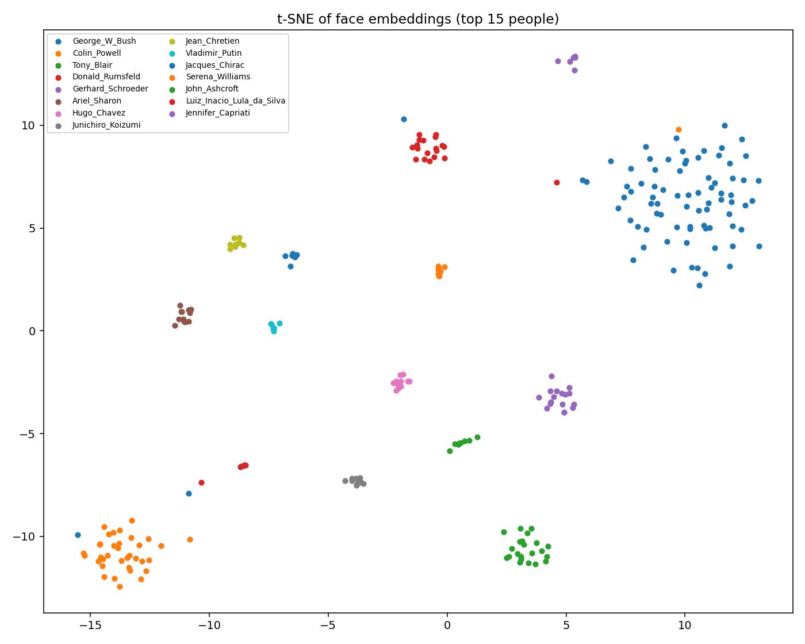
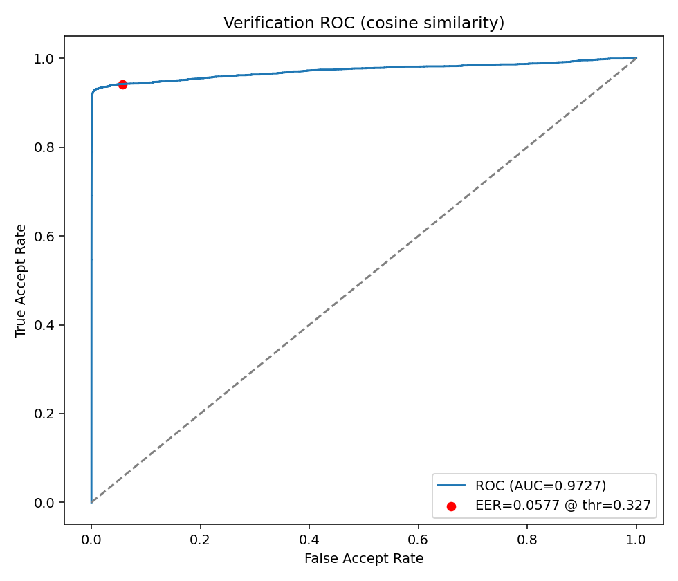
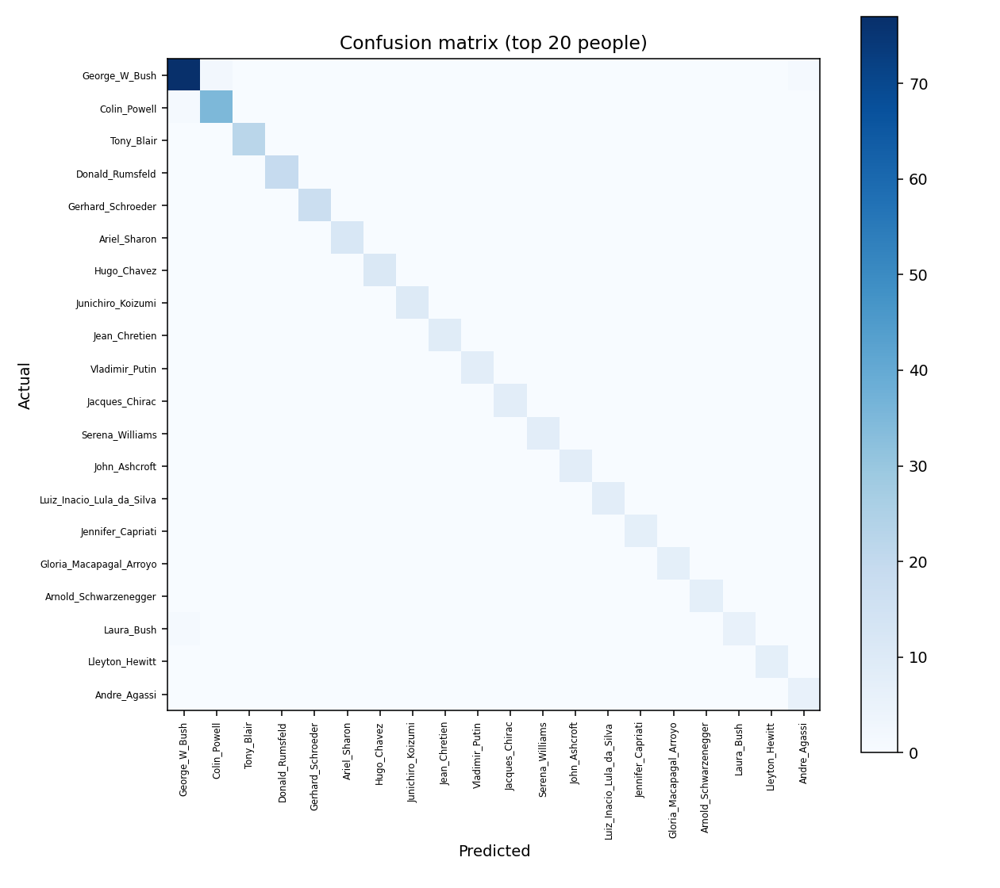

# AI 안면인식 출퇴근 시스템

얼굴 인식으로 직원의 출·퇴근을 기록하는 데스크톱 애플리케이션입니다.
사전학습된 얼굴 인식 모델(VGGFace2)의 임베딩과 코사인 유사도를 이용해,
**재학습 없이** 직원을 등록하고 인식합니다.

이 문서는 두 부분으로 나뉩니다.

- **Part 1. 애플리케이션** — 설치·실행, 기능, 설정 설명
- **Part 2. 모델 (연구·실험)** — 데이터셋, 사용 모델, 비교 실험과 결과

---
---

# Part 1. 애플리케이션

## 1.1 설치 및 실행

릴리즈에 올라온 압축 파일을 받아 **압축을 풀고 실행 파일을 실행**하면 됩니다.
별도의 파이썬 설치나 패키지 설치가 필요 없습니다.

```
1. 릴리즈에서 배포 파일(zip) 다운로드
2. 압축 해제 (가급적 한글·공백 없는 경로 권장, 예: C:\Attendance\)
3. 폴더 안의 실행 파일 실행
```

- 첫 실행 시 `config.json`(설정)과 `attendance.db`(데이터베이스)가 실행 파일 옆에 자동 생성됩니다.
- 직원 얼굴은 앱 안에서 직접 등록하므로, 별도의 학습 데이터 준비가 필요 없습니다.

## 1.2 화면 구성

앱은 네 개의 탭으로 구성됩니다.

| 탭 | 설명 |
|----|------|
| 실시간 인식 | 카메라로 얼굴을 인식해 출·퇴근을 기록 |
| 직원 관리 | 직원 등록·삭제·검색 |
| 근태 기록 | 날짜별 출퇴근 기록 조회·엑셀 추출 |
| 설정 | 인식·근태·음성 등 동작 방식 설정 |

## 1.3 직원 등록

직원 관리 탭에서 **이름을 입력**하면 등록 버튼이 활성화됩니다. 세 가지 방법이 있습니다.

- **캡처로 등록** — 카메라 미리보기를 보며 ‘현재 얼굴 캡처’로 여러 장(권장 10장) 수집
- **영상으로 등록** — 버튼을 누르면 약 5초간 자동으로 여러 각도를 수집(가만히 또는 고개를 살짝 움직임)
- **영상 업로드** — 미리 찍어둔 얼굴 영상 파일에서 자동 추출

직원 ID(E001, E002 …)는 자동 부여됩니다. 여러 장을 평균낸 임베딩으로 등록되어 각도·표정 변화에 강건합니다.

## 1.4 출퇴근 인식 동작

실시간 인식 탭에서 ‘인식 시작’을 누르면 카메라가 켜집니다.

- 등록된 얼굴이 안정적으로 일치하면 동작(출근/퇴근 등)을 기록합니다.
- **재인식 방지**: 한 번 처리되면, 얼굴이 화면에서 사라졌다가 다시 와야 다시 인식됩니다.
  같은 사람이 계속 서 있어도 중복 기록되지 않으며, **다른 사람이 오면 즉시 인식**됩니다.
- 한 사람을 처리한 직후 짧은 완충 시간(기본 1초) 동안만 잠시 대기합니다.

## 1.5 근태 모드 (설정)

설정 탭의 ‘근태 모드’에서 세 가지 중 하나를 고릅니다.

| 모드 | 동작 |
|------|------|
| 출근 / 퇴근 (수동) | 2단계. 인식 후 출근 또는 퇴근 버튼 선택 |
| 출근 / 외출 / 복귀 / 퇴근 (수동) | 4단계. 외출·복귀까지 버튼으로 선택 |
| 출근 / 퇴근 (자동) | 2단계. 카메라 앞에 일정 시간 서 있으면 버튼 없이 자동 처리 |

- **퇴근 갱신**: 퇴근한 사람이 같은 날 다시 인식되면 ‘퇴근 시각 갱신’이 가능합니다.
  새 기록을 추가하지 않고 기존 퇴근 시각만 수정합니다(실수로 일찍 찍은 경우 대비).
- **자동 모드는 2단계에서만** 동작합니다(외출/복귀는 사용자가 선택해야 하므로).

## 1.6 자동 모드 옵션 (설정)

근태 모드를 ‘자동’으로 고르면 아래 옵션이 나타납니다.

- **체류 시간(초)** — 자동 처리까지 카메라 앞에 서 있어야 하는 시간(기본 2초). 잠깐 지나가는 사람은 무시됩니다.
- **예정 동작 미리 표시** — 처리 직전 “홍길동 — 곧 [퇴근] 처리 · 1.3초”처럼 무엇이 기록될지 미리 보여줍니다.
- **완료 팝업** — 처리되면 “홍길동 / 출근 완료” 큰 팝업을 띄웁니다.
- **팝업 표시 시간(초)** — 팝업이 자동으로 닫히기까지의 시간.

## 1.7 음성 안내 (설정)

- **음성 안내**를 켜면 처리 완료 시 “홍길동님 출근”처럼 이름과 상태를 읽어줍니다.
- 수동·자동 모드 모두에서 동작합니다.
- Windows 내장 음성엔진을 사용하며, 한국어 음성이 설치돼 있으면 한국어로 안내합니다.
  (음성 기능이 없는 환경에서는 자동으로 비활성화되며 다른 기능에는 영향이 없습니다.)

## 1.8 그 밖의 설정

| 항목 | 설명 |
|------|------|
| DB 경로 | 출퇴근 기록을 저장할 데이터베이스 파일 위치. 없으면 자동 생성 |
| 유사도 임계값 | 같은 사람으로 인정할 최소 유사도(기본 0.85). 높일수록 엄격 |
| 투표 프레임 수 | 같은 사람이 연속 몇 프레임 일치해야 인식 확정(기본 5). 오인식 방지 |
| 카메라 | 사용할 카메라 선택(검색·테스트 버튼 제공) |
| GPU FP16 가속 | GPU에서 반정밀도 연산으로 속도 향상 |

설정은 실행 파일 옆 `config.json`에 저장되어 다음 실행 시 자동 적용됩니다.

## 1.9 근태 기록 조회·추출

- 이름/ID와 **날짜 범위**(달력 선택)로 기록을 조회합니다. 기본값은 이번 달 1일~오늘.
- 최신순(날짜·시각)으로 정렬되며, 상태는 색으로 구분됩니다(출근=초록, 외출=주황, 복귀=파랑, 퇴근=회색).
- ‘엑셀 추출’로 조회 결과를 `.xlsx`로 저장할 수 있습니다.

## 1.10 장시간 운영 참고

- 카메라 신호가 끊겨도 자동으로 재연결을 시도합니다.
- 장시간 운영 시 GPU 메모리를 주기적으로 정리합니다.
- 24시간 무인 운영이라면, 안정성을 위해 하루 1회 정도 앱을 재시작하는 것을 권장합니다.
  (설정·기록은 파일로 저장되므로 재시작해도 데이터는 유지됩니다.)

---
---

# Part 2. 모델 (연구·실험)

이 부분은 어떤 얼굴 인식 방식들을 비교했고, 왜 최종적으로 **유사도(임베딩) 방식**을
실제 앱에 채택했는지를 설명합니다. 학습·실험용 코드이며, 배포 앱 동작과는 독립적입니다.

## 2.1 데이터셋

- **출처**: LFW(Labeled Faces in the Wild) 공개 데이터셋
- **전처리**: MTCNN으로 얼굴을 검출·정렬하여 160×160 크기로 크롭. 검출 신뢰도가 낮은 프레임은 제외.
- **선별**: 사진이 10장 이상인 인물만 사용. 최종 **158명 / 4,316장**.
- **분할**: 인물별로 train 70% / val 15% / test 15%로 나눔(재현 가능하도록 고정 시드 사용).
- **증강**: 학습 데이터에 한해 좌우 반전·색상 지터 적용(검증·테스트에는 미적용).
- **라벨링**: 폴더명이 곧 라벨(인물 ID). 별도 수작업 라벨링 없음.

## 2.2 사용 모델

- **백본**: InceptionResnetV1 (facenet-pytorch), VGGFace2로 사전학습된 가중치.
  얼굴을 512차원 임베딩 벡터로 변환합니다.
- **분류 방식**에서는 백본 위에 `Linear(512 -> 인물 수)` 분류 헤드를 붙여 학습합니다.
- **유사도 방식**에서는 학습 없이, 사람별 평균 임베딩(프로토타입)을 만들고
  입력 임베딩과 **코사인 유사도**가 가장 높은 사람으로 판별합니다. (실제 앱이 쓰는 방식)

## 2.3 비교한 방식

동일 데이터에서 아래 7가지를 비교했습니다.

| 실험 | 방식 | 핵심 |
|------|------|------|
| exp00 | 유사도(임베딩) | 학습 없음, 사전학습 임베딩만 사용 (실제 앱 방식) |
| exp01 | 분류 — 백본 동결 | 분류 헤드만 학습 |
| exp02 | 분류 — 마지막 2블록 미세조정 | 백본 일부까지 추가 학습 |
| exp03 | 분류 — 처음부터 학습 | 사전학습 미사용(백본 없음) 비교군 |
| exp04 | 분류 — 동결 + 증강 끔 | 증강 효과 확인 |
| exp05 | 분류 — 동결 + 낮은 학습률 | 학습률 영향 확인 |
| exp06 | 임베딩 + MLP 분류기 | 임베딩 위에 직접 설계한 MLP(은닉 2층, BatchNorm·Dropout) 학습 |

## 2.4 성능 평가 지표

| 지표 | 의미 |
|------|------|
| 정확도(Accuracy) | 전체 테스트 중 맞춘 비율. 데이터가 많은 사람에게 점수가 쏠릴 수 있음 |
| Macro-F1 | 사람별 F1을 평균. 사진이 적은 사람도 동등하게 평가하므로 불균형에 공정 |
| 혼동 행렬 | 누구를 누구로 착각하는지 확인(오류 원인 분석용) |
| 추론 시간 / FPS | 사진 한 장 처리 속도. 실시간 기준 FPS >= 15를 목표로 함 |
| ROC / AUC / EER | 두 얼굴이 동일인인지 판별하는 검증 성능. 인식 임계값 설정의 근거 |

정확도와 Macro-F1을 함께 보면, 정확도는 높은데 Macro-F1이 낮을 경우
“다수 인물만 잘 맞추고 소수 인물은 놓친다”는 신호로 해석할 수 있습니다.

## 2.5 결과

| 실험 | 방식 | test 정확도 | Macro-F1 | FPS |
|------|------|------------|----------|-----|
| exp00 | 유사도(학습 없음) | 0.9601 | 0.9601 | 89.2 |
| exp01 | 분류 — 동결 | 0.9668 | 0.9567 | 42.2 |
| exp02 | 분류 — 미세조정 | 0.9640 | 0.9542 | 42.7 |
| exp03 | 분류 — 처음부터 학습 | 0.7441 | 0.6250 | 69.2 |
| exp04 | 분류 — 동결 + 증강끔 | 0.9682 | 0.9607 | 93.6 |
| exp05 | 분류 — 낮은 학습률 | 0.7870 | 0.6222 | 82.7 |
| exp06 | 임베딩 + MLP 분류기 | **0.9696** | **0.9624** | 3472.7* |

\* exp06의 FPS는 임베딩에서 MLP만 통과하는 속도(백본 제외)라 다른 실험과 직접 비교 대상은 아님.

### 임베딩 분석 (시각화)

`analyze_embeddings.py`로 임베딩 품질을 정량·시각적으로 분석했습니다.

**t-SNE** — 512차원 임베딩을 2D로 투영하면 같은 사람끼리 뚜렷한 군집을 이룹니다(사전학습 임베딩의 분리력 확인).



**검증 ROC** — 모든 얼굴 쌍의 코사인 유사도로 "동일인 여부"를 판별한 성능. **AUC 0.9727, EER 5.77%** 로, 임베딩만으로도 신뢰할 만한 분리력을 보입니다. 임계값을 임의로 정하지 않고 데이터로부터 정당화할 수 있습니다.



**혼동 행렬** — 대각선(정답)에 집중되어 있고, 오분류는 주로 표본이 적은 소수 인물에서 발생합니다.



## 2.6 분석 및 결론

- **사전학습(전이학습)이 결정적이다.** 백본 없이 처음부터 학습한 exp03은 정확도 0.74,
  Macro-F1 0.63으로 크게 떨어졌다. 4,316장 규모로는 백본을 처음부터 학습하기에 데이터가 부족하다.
  학습률을 낮춘 exp05(0.79)도 충분히 수렴하지 못했다. 즉 **데이터 양과 학습 옵션에 따라
  백본 없는 모델의 성능은 매우 불안정**했다.
- **직접 설계한 MLP(exp06)가 수치상 가장 높았다(0.9696).** 임베딩 위에 분류기를 직접 학습하면
  최고 성능을 얻을 수 있음을 확인했다. 다만 사전학습 기반 방식들(exp00~02, exp04, exp06)의
  차이는 **1%p 이내로 유의미하다고 보기 어렵다**(테스트 표본 723장).
- **학습 없는 유사도 방식(exp00)도 사실상 동등하다.** 정확도 0.9601로 최고(exp06)와 약 1%p 차이이며,
  별도 학습이 전혀 필요 없다.

**최종 결론 — 실제 앱은 유사도(임베딩) 방식을 채택한다.**
성능상 최적은 직접 학습한 MLP(exp06)였지만 그 우위는 유의미하지 않고, 분류·MLP 방식은
**새 직원이 들어올 때마다 출력 클래스를 바꿔 재학습**해야 한다. 반면 유사도 방식은 사전학습 임베딩만으로
동작하므로 **재학습 없이 등록만으로 직원을 추가**할 수 있고 속도도 빠르다.
즉 **성능상 최적(exp06)과 운영상 최적(exp00)을 모두 확인한 뒤**, 인원이 수시로 바뀌는 출퇴근 환경에서는
운영 편의성이 결정적이고 정확도 차이도 미미하므로 유사도 방식을 선택했다.

## 2.7 학습·실험 재현 (참고)

```bash
# 1) LFW 데이터셋을 Kaggle 에서 받아 data/ 에 배치
#    https://www.kaggle.com/datasets/jessicali9530/lfw-dataset
#    압축을 풀면 data/lfw-deepfunneled/{인물}/*.jpg 구조가 된다.
#    (함께 들어있는 csv 메타파일은 사용하지 않으므로 무시해도 됨)

# 2) MTCNN 정렬 -> data/raw/{인물}/*.pt
python utils/prepare_lfw.py --lfw_dir data/lfw-deepfunneled --min_images 10

# 3) train/val/test 분할
python utils/split_dataset.py

# 4) 6개 비교 실험 실행 -> runs/comparison.csv
python run_experiments.py

# 5) (추가) 임베딩 위 MLP 분류기 학습 -> exp06
python train_mlp.py

# 6) (추가) 임베딩 분석 그림 생성 -> runs/figs/
python analyze_embeddings.py

# 7) 학습 곡선 확인
tensorboard --logdir runs
```

> 참고: 동봉된 `utils/download_lfw.py` 는 원 배포처(umass.edu) 도메인이 응답하지 않는 환경에서는
> 동작하지 않을 수 있다. 그럴 때는 위와 같이 Kaggle 등에서 직접 받아 배치하면 된다.

실험은 중간에 멈춰도 다시 실행하면 완료된 실험은 건너뛰고 이어서 진행됩니다.
